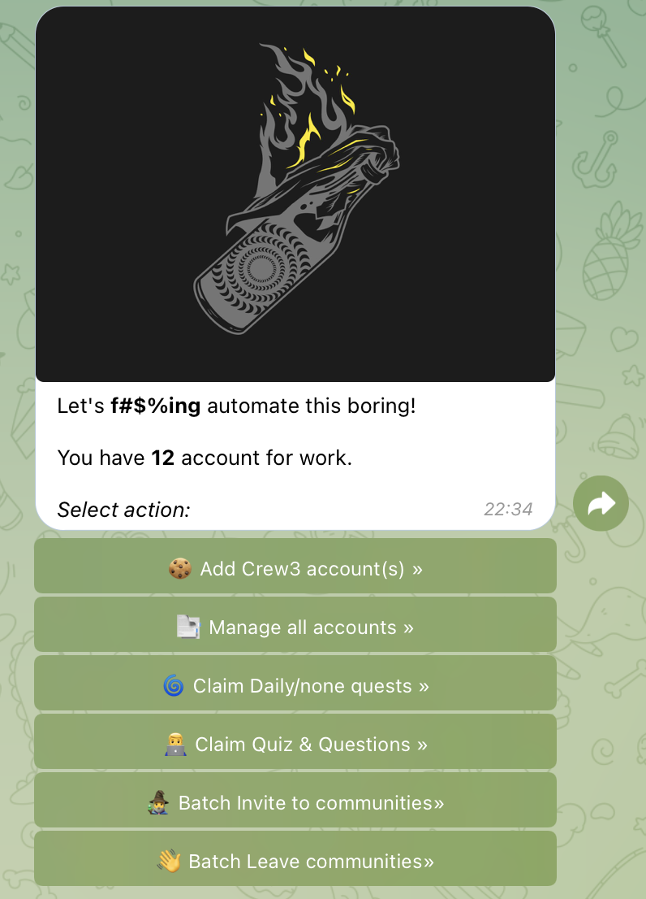
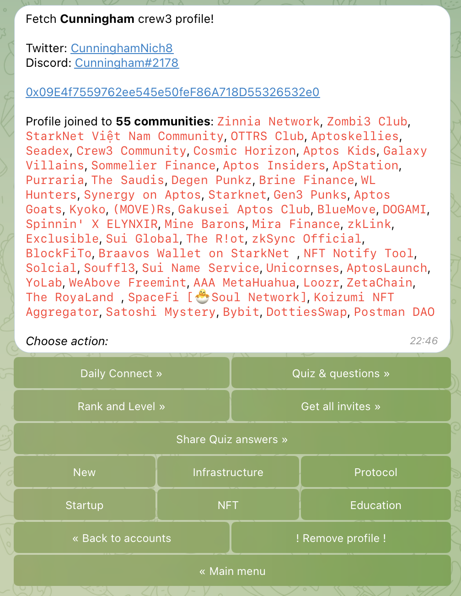

# Telegram Crew3

The script allows you to manage multiple Crew3 accounts, using a telegram bot as a user interface.

<div style="display:flex">
  
  
</div>

## Implemented features

1. Sign to crew3 site by private key
2. See account(s) info
3. Claim daily quests and tasks without requirements
4. Submit and claim quiz and text quests
5. Invites/leaves communities
6. Check your rank and level
7. Search new communities by crew3 tags (NFT, Protocol, Startup and etc)

## TODO list (maybe someday)

1. Twitter auto-follow/retweet/reply/like functions
2. Discord auto-join
3. Wallet generation and submit
4. Deploy to server (bot webhook and pre-deploy helper)

- Open to your suggestions - https://t.me/Salcez (Ru|En)

## Changelog

5 December updates:

- Simple logging check of modules work and requirements.
- Concat batch claiming. None, quiz, texts, telegram quest now claiming together.
- Change account info message, add another wallets (SUI, Aptos, Starknet).
- Now you can add empty accounts (without discord/twitter/email). They can be used in invitations for some easy communities.
- Now after accept invite application account trying to take all the quests he can.
- Accounts.csv format except ";" and "," separators. Format "address;privateKey".
- Empty account filter in manage accounts list.
- Now you can send EVM-address to bot and it will find the corresponding account.
- Command "/new #end_page# #start_page#" - show new communities and it's requirements.
- Add shuffle to claim and join processing
- Autogenerate usernames for empty profiles
- Crew3 Module has new functions for future updates: changeSettings, sendMagicLink
- Some fixes

## Requirements

1. Create telegram bot by `https://t.me/BotFather`
2. Find out your telegram ID by bot `https://t.me/getmyid_bot`
3. Rename `env` to `.env` and input data

## Secure

1. Bot use local sessions.json database with your cookies
2. Bot can share your answers to public `answers database` only if you want to share it
3. You can use our own answers database by changing url in `answers-database.ts`

## Setup bot

1. Download ZIP and extract it to a folder (or better use git(`https://git-scm.com/`) for getting updates)
2. Install node.js: `https://nodejs.org/en/` (LTS)
3. Open folder with the bot in `cmd`

```bash
cd <path to folder with script>
```

5. Install dependencies

```bash
npm install
```

6. Start

```bash
npm run start
```

7. Go to your created telegram bot and send `/start`

## Donate for updates

EVM: `0xac1c08185ba23b28ac0c723abbb93ab9dc00dead`
